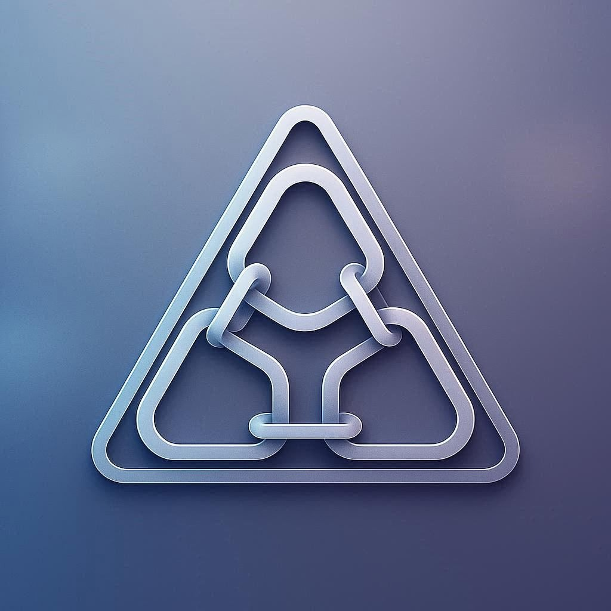

<p align="center">
  
</p>

<h1 align="center">Linker - 智能硬链接管理系统</h1>

<p align="center">
  <strong>高性能、企业级的硬链接批量管理工具</strong><br>
  为 NAS、媒体库、备份系统提供专业的文件同步解决方案
</p>

---

## 📖 目录

- [核心特性](#-核心特性)
- [技术架构](#-技术架构)
- [快速开始](#-快速开始)
- [功能详解](#-功能详解)
- [配置指南](#-配置指南)
- [开发指南](#-开发指南)
- [常见问题](#-常见问题)

---

## ✨ 核心特性

### 🎯 智能管理
- **智能重复检测** - 基于文件内容的 MD5 校验
- **文件名变更追踪** - 即使文件名改变，依然能准确识别并建立硬链接
- **增量同步** - 仅处理变更文件，大幅提升处理效率
- **缓存机制** - 智能缓存文件信息，避免重复扫描

### ⚡ 极致性能 (Go Backend)
- **Go 语言重构** - 采用 Go 语言重写核心引擎，性能大幅提升
- **并发处理** - 多线程并发扫描和链接，充分利用系统资源
- **内存优化** - 极低的内存占用，适合长期运行
- **秒级响应** - API 响应速度快，操作流畅

### 🎨 现代化界面 (Web UI)
- **全新品牌 Linker** - 简约现代的 UI 设计
- **实时反馈** - 任务执行状态实时更新
- **智能报错** - 监听失败时提供置顶悬浮的详细错误归类（源路径/目标路径）
- **可视化配置** - 图形化配置界面，操作直观

### 🔄 自动化运维
- **实时监控** - 文件系统监听，自动同步变更
- **定时任务** - 支持 Cron 表达式的定时执行
- **任务队列** - 智能任务调度
- **日志追踪** - 详细的操作日志

---

## 🏗️ 技术架构

### 前端技术栈
```
Vue 3 + TypeScript + Vuetify 3
├── 组件化架构
├── Pinia 全局状态管理
├── Vue Router 路由管理
├── UI 框架 - Vuetify 3
└── 构建工具 - Vite
```

### 后端技术栈
```
Go (Golang)
├── Gin Web 框架
├── PostgreSQL (配置/任务存储)
├── fsnotify 文件监听
└── 并发协程模型
```

---

## 🚀 快速开始

### 源码运行

#### 1. 启动后端 (Go)
```bash
# 确保已安装 Go 1.20+
cd server
go run cmd/server/main.go
# 服务默认运行在 :9090
```

#### 2. 启动前端 (Vue)
```bash
cd web
pnpm install
pnpm dev
# 访问 http://localhost:5173 (开发模式)
```

或使用根目录脚本（如果有）：
```bash
./start-server.sh
./start-web.sh
```

### Docker 部署

**🎉 前后端已整合为单一镜像，部署更简单！**

#### 使用 docker-compose（内置 Postgres）
```bash
# 在项目根目录
docker-compose up -d

# 访问应用
# http://localhost:19090
```

#### 使用 docker-compose.external-db（外部 Postgres）
```bash
# 需先配置环境变量（POSTGRES_HOST, POSTGRES_USER, POSTGRES_PASSWORD, POSTGRES_DB）
docker-compose -f docker-compose.external-db.yml up -d

# 访问应用
# http://localhost:19090
```

#### 构建镜像
```bash
# 构建统一镜像（包含前后端）
docker build -t fasaxi-linker:latest .
```

**架构说明**：
- ✅ 前后端整合到单一镜像
- ✅ Go 后端直接提供前端静态文件
- ✅ 单一端口 19090 提供所有服务
- ✅ 无需 Nginx，部署更简单

---

## 🎯 功能详解

### 1. 任务管理
- **硬链 (main)**: 创建硬链接
- **同步 (prune)**: 清理失效链接
- **实时监控**: 开启后，前端任务卡片会显示"监控中"。如果路径配置错误（如源路径不存在），卡片会变红并在列表顶部悬浮显示详细错误信息。

### 2. 缓存管理
智能缓存系统提升性能，记录文件 MD5、大小等信息。支持手动清理和自动更新。

---

## ⚙️ 配置指南

### 基础配置示例
```javascript
{
  name: "media-library",
  description: "媒体库同步",
  include: ["*.mp4", "*.mkv"],
  exclude: ["*.tmp"],
  keepDirStruct: true,
  openCache: true
}
```

---

## 🛠️ 开发指南

### 目录结构
```
.
├── server/          # Go 后端代码
│   ├── cmd/         # 入口文件
│   ├── internal/    # 业务逻辑
│   └── pkg/         # 公共包
├── web/             # Vue 前端代码
│   ├── client/      # 源代码
│   └── public/      # 静态资源
└── README.md
```

### 贡献代码
欢迎提交 PR 或 Issue。

---

## 📄 开源协议

本项目采用 [MIT License](LICENSE) 开源协议。
